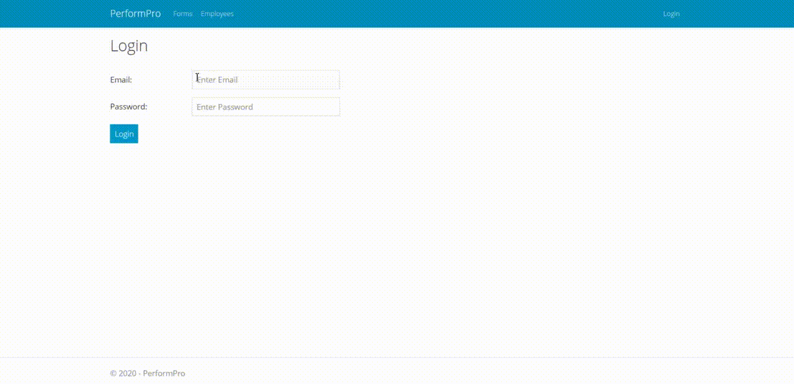
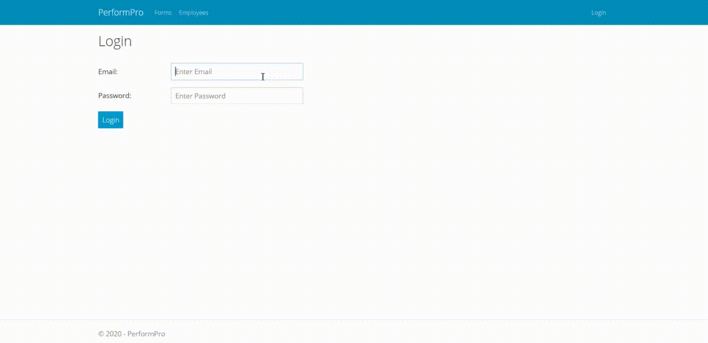

# PerformPro

Doing performance management activies on paper is no longer time efficient at USA Health. The goal of this project was to create an electronic version of a paper performance review form. Our team developed a web application using ASP.NET MVC for the electronic submission, editing, and viewing of performance review forms. Supervisors are able to create forms for employees under them, and administrators can view forms for all employees as well as manage supervisors and employees. Users and roles are handled using ASP.NET Core Identity.

## Client Information

Sponsor and Mentor:
* Steven Travers, Ph.D., M.B.A.
* Chief Information Officer (CIO) at USA Health

Contact:
* [(stravers@health.southalabama.edu)](mailto:stravers@health.southalabama.edu?subject=[GitHub]%20PerformPro)

## Contributors

* Jonathan Foots [(jmf1523@jagmail.southalabama.edu)](mailto:jmf1523@jagmail.southalabama.edu?subject=[GitHub]%20PerformPro)
* Kaitlyn Geiger [(kdg1522@jagmail.southalabama.edu)](mailto:kdg1522@jagmail.southalabama.edu?subject=[GitHub]%20PerformPro)
* Nicholas Leibold [(ndl1521@jagmail.southalabama.edu)](mailto:ndl1521@jagmail.southalabama.edu?subject=[GitHub]%20PerformPro)
* Michael Powell [(mjp1221@jagmail.southalabama.edu)](mailto:mjp1221@jagmail.southalabama.edu?subject=[GitHub]%20PerformPro)

## Features

For Administrators:
* View, soft delete, and restore forms
* View, create, edit, soft delete, and restore supervisors
* View, create, edit, soft delete, and restore employees
* Reset password

For Supervisors:
* View, edit, and create forms
* View list of employees
* Reset password

## Limitations

This is the first version of an application meant to be passed on to later groups. Therefore, some features that may be useful are not yet included, such as the ability to:
* Import supervisors and employees from files
* Export forms as PDF files
* Authentication with SSO
* Use advanced search features

## How to Use

Operating System: Windows

Required Downloads:
* [Visual Studio](https://visualstudio.microsoft.com/downloads/)
* [SQL Server Express](https://www.microsoft.com/en-us/sql-server/sql-server-downloads)
* [SQL Server Management Studio](https://docs.microsoft.com/en-us/sql/ssms/download-sql-server-management-studio-ssms?view=sql-server-ver15)

Required NuGet Packages in Visual Studio:
* Microsoft.AspNetCore.Identity.EntityFrameworkCore (3.1.3)
* Microsoft.EntityFrameworkCore (3.1.3)
* Microsoft.EntityFrameworkCore.Design (3.1.3)
* Microsoft.EntityFrameworkCore.SqlServer (3.1.3)
* Microsoft.EntityFrameworkCore.Tools (3.1.3)
* Microsoft.VisualStudio.Web.CodeGeneration.Design (3.1.2)
* System.Data.SqlClient (4.8.1)

Required Database Files: [PerformPro-Database](https://github.com/KDanielleGeiger/PerformPro-Database)

Follow the remaining instructions in the repository linked above to complete setup.

## Account Information

Administrator Account:
* Username: admin@example.com
* Default Password: Test123!

Supervisor Account:
* Default Password: Test123!

## Demo 1/2: Administrator View

## Demo 2/2: Supervisor View

